<!--Matrix Background Animation-->

<!--Greet Line-->

<!--Rainbow Line-->

  

<!--Name Anmiation-->

  

<!--Description-->
# 💫 About Me:
🔭 I’m currently working on improving my coding skills! 🧠📊 🌱 I’m currently learning Java, Python, and JavaScript 💻 👯 I’m looking to collaborate on beginner-friendly or impact-driven projects 🤝 🤝 I’m looking for help with improving my coding skills and building better apps 🚀 💬 Ask me about my projects, science fair, or anything tech + health related! 📫 How to reach me: sarah.lo.0309@gmail.com 😄 Pronouns: She/Her ⚡ Fun fact: I love combining biology and technology to solve real-world problems 🧬

## 🌐 Socials:
 

# 💻 Tech Stack:
       
# 📊 GitHub Stats:
 
 

### ✍️ Random Dev Quote

## 🐍 Snake Animation

<!--Rainbow Line-->

  

